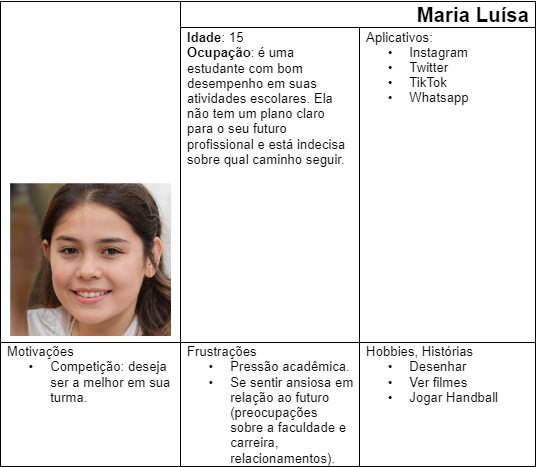
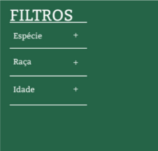

# Informações do Projeto
`PET GETS`  

Trabalho Interdisciplinar 

`CIÊNCIA DA COMPUTAÇÃO` 

## Participantes

Os membros do grupo são:
- João Pedro de Meireles Alves
- Paulo Henrique Braga Pessoa
- Rafael Lage Schichman
- Rafael Lucca Marques
- Rafael Correa Fernandes
- Arthur Campos Pereira

# Estrutura do Documento

- [Informações do Projeto](#informações-do-projeto)
  - [Participantes](#participantes)
- [Estrutura do Documento](#estrutura-do-documento)
- [Introdução](#introdução)
  - [Problema](#problema)
  - [Objetivos](#objetivos)
  - [Justificativa](#justificativa)
  - [Público-Alvo](#público-alvo)
- [Especificações do Projeto](#especificações-do-projeto)
  - [Personas, Empatia e Proposta de Valor](#personas-empatia-e-proposta-de-valor)
  - [Histórias de Usuários](#histórias-de-usuários)
  - [Requisitos](#requisitos)
    - [Requisitos Funcionais](#requisitos-funcionais)
    - [Requisitos não Funcionais](#requisitos-não-funcionais)
  - [Restrições](#restrições)
- [Projeto de Interface](#projeto-de-interface)
  - [User Flow](#user-flow)
  - [Wireframes](#wireframes)
- [Metodologia](#metodologia)
  - [Divisão de Papéis](#divisão-de-papéis)
  - [Ferramentas](#ferramentas)
  - [Controle de Versão](#controle-de-versão)
- [**############## SPRINT 1 ACABA AQUI #############**](#-sprint-1-acaba-aqui-)
- [Projeto da Solução](#projeto-da-solução)
  - [Tecnologias Utilizadas](#tecnologias-utilizadas)
  - [Arquitetura da solução](#arquitetura-da-solução)
- [Avaliação da Aplicação](#avaliação-da-aplicação)
  - [Plano de Testes](#plano-de-testes)
  - [Ferramentas de Testes (Opcional)](#ferramentas-de-testes-opcional)
  - [Registros de Testes](#registros-de-testes)
- [Referências](#referências)

# Introdução

Ao longo das últimas décadas, índices mundiais de problemas como a solidão e depressão vem sofrendo um aumento considerável. Assim, há uma clara antítese entre o paradigma atual de integração social através da tecnologia, e o real sentimento de acolhimento daqueles que desfrutam dessas tecnologias.
Nesse contexto, é possível apontar a adoção de animais de estimação como uma solução para aqueles que sofrem com as mazelas previamente apresentadas. E, por essa razão, é pertinente que se desenvolvam métodos para facilitar e simplificar esse processo de adoção, de modo a torná-lo mais acessível e atrativo àqueles que poderiam se beneficiar dele.
Além disso, não se pode esquecer da imensa importância da adoção para animais de rua e em situação de abandono, que agora passariam a desfrutar de moradia, alimentação, cuidado veterinário e afeto, além de livrá-los dos diversos perigos e prejuízos que encontram nas ruas.
Por outro lado, há ainda a necessidade de garantir que o animal adotado receba um tratamento de qualidade e, para isso, o novo dono deve ser devidamente instruído sobre como cuidar desse animal específico.

## Problema

A partir da realidade explicitada anteriormente, os problemas principais a serem mitigados por este projeto são o excesso de burocracia existente no processo de adoção de animais de estimação e a desinformação de novos adotivos com relação aos cuidados de seu animal.

## Objetivos

O objetivo geral deste projeto é a criação de uma plataforma que facilite o processo de adoção de animais de estimação e instrua seus usuários sobre os cuidados básicos de diversos animais expostos à adoção.
  Como objetivos específicos:
- Fornecer, ao usuário, o contato de casas de adoção próximas e com quais animais elas trabalham.
- Proporcionar, ao usuário, uma "ficha técnica" para diversos animais, que apresente suas necessidades básicas como alimentação, habitat e cuidados especiais.

## Justificativa

Segundo uma pesquisa do Instituto Ipsos, o Brasil é a nação em que as pessoas mais sofrem da solidão. 23 mil pessoas de 28 países foram entrevistadas em 2021, e cerca de 50% dos brasileiros responderam que se sentem sozinhos, enquanto a média global é de 33%.
 Além disso, de acordo com o InstitutoPetBrasil, existem hoje, no Brasil, cerca de 185.000 animais abandonados ou resgatados por maus-tratos sob a tutela de ONGs e grupos protetores.

## Público-Alvo

O público ao qual este projeto está direcionado são pessoas de todas as idades que estejam abertas à ideia de adotar um animal. Seja para lidar com problemas psicológicos, como a depressão, ou apenas para desfrutar da vida com um companheiro.

## Especificações do Projeto

A definição exata do problema e os pontos mais relevantes a serem tratados neste projeto foi consolidada com a participação dos usuários em um trabalho de imersão feita pelos membros da equipe a partir da observação dos usuários em seu local natural e por meio de entrevistas. Os detalhes levantados nesse processo foram consolidados na forma de personas e histórias de usuários.

## Personas, Empatia e Proposta de Valor

As personas levantadas durante o processo de entendimento do problema são apresentadas na Figuras que se seguem.

**Exemplo de Persona**

## Histórias de Usuários

A partir da compreensão do dia a dia das personas identificadas para o projeto, foram registradas as seguintes histórias de usuários:

|     EU COMO...     |          QUERO/PRECISO ...         |              PARA ...                                               |
|--------------------|------------------------------------|----------------------------------------                             |
|Maria Luísa         | Eu gostaria de adotar um gato.     | Na minha opinião, os gatos são criaturas adoráveis e afetuosas. Mesmo que cuidar de um gatinho seja uma grande responsabilidade, ainda sim gostaria de adotar, seria muito gratificante e divertido.|      
|Hélio Dias          | Eu estou interessado em adotar um cãozinho de porte pequeno e com um temperamento tranquilo.| Para mim ter um cão seria uma excelente forma de ter companhia em casa. Os cães são animais muito sociais e gostam de interagir com seus donos.|       
|Cristiano Marques   | Eu sou muito fã de cães, acho que teria um mais um em casa.| Sempre tive grande apreço por cachorros e os considero excelentes companheiros. A adoção de animais, em vez de comprá-los, é fundamental para ajudar a reduzir o número de bichinhos abandonados nas ruas.|                                                            
                                         
## Requisitos

O escopo funcional do projeto é definido por meio dos requisitos funcionais que descrevem as possibilidades interação dos usuários, bem como os requisitos não funcionais que descrevem os aspectos que o sistema deverá apresentar de maneira geral. Estes requisitos são apresentados a seguir.

### Requisitos Funcionais

|ID     | Descrição do Requisito  |Prioridade |
|-------|-----------------------------------------|----|
|RF-001 | O site deve apresentar uma página principal para o usuário encontrar o animal que deseja. |ALTA| 
|RF-002 | O site deve apresentar, para cada animal, uma imagem.   | ALTA |
|RF-003 | O site deve permitir ao usuário visualizar uma descrição completa do animal e do contato do doador. |ALTA|
|RF-004 | O site deve oferecer uma funcionalidade de filtro/pesquisa para permitir ao usuário localizar um animal específico. |ALTA|
|RF-005 | O site deve permitir visualizar as informações de contatos do mantenedor do site. |BAIXA|
|RF-006 | O site deve possuir um formulário que permita ao usuário enviar informações sobre um animal que ele deseja colocar para adoção. |MÉDIA|

### Requisitos não Funcionais

|ID     | Descrição do Requisito  |Prioridade |
|-------|-------------------------|----|
|RNF-001| O site deve ser publicado em um ambiente acessível publicamente na Internet (Repl.it, GitHub Pages, Heroku); |ALTA| 
|RNF-002| O site deverá ser responsivo permitindo a visualização em um celular de forma adequada |ALTA| 
|RNF-003| O site deve ser compatível com os principais navegadores do mercado (Google Chrome, Firefox, Microsoft Edge) |ALTA|
|RNF-004| O site deve ter bom nível de contraste entre os elementos da tela em conformidade |MÉDIA|

## Restrições

As questões que limitam a execução desse projeto e que se configuram como obrigações claras para o desenvolvimento do projeto em questão são apresentadas na tabela a seguir.

|ID| Restrição                                             |
|--|-------------------------------------------------------|
|RE-01| O projeto deverá ser entregue no final do semestre letivo, não podendo extrapolar a data estipulada.|
|RE-02| O aplicativo deve se restringir às tecnologias básicas da Web no Frontend.|
|RE-03| A equipe não pode subcontratar o desenvolvimento do trabalho.|

# Projeto de Interface

O projeto de interface foi pensado em conjunto visando algo otimizado e totalmente intuitivo que prioriza o nosso público alvo, que são as pessoas de toda a faixa etária. Dessa forma conseguiremos agradar todo o tipo de público que será usuária do site. Além disso, foi priorizado também de acordo com o que discutimos sobre os requisitos funcionais e não funcionais, para nao fugiir do que foi proposto.

## Wireframes

Wireframe pode ser definido como um modelo simplificado de uma estrutura de uma possível interface para o seu usuário. Utilizamos o wireframe para planejar e projetar as funcionalidades que estarão no site. Também foi possível utilizar as pessoas do mapa de stakeholders para obter um feedback antes de lançar o projeto.

**PROTÓTIPO DO WIREFRAME**

- Cabeçalho: Estará disposto uma logo oficial da marca e um menu interativo para o usuário se localizar.
- Conteúdo: Aqui ficara o conteúdo principal do site, onde buscaremos manter a atenção do usuário.
- Barra Lateral: Elemente de navegação lateral para o usuário filtrar o que for melhor para sua procurar no site.

**CONTEÚDO**

Com base na estrutura padrão, a página inicial do conteúdo irá destacar para o usuário uma lista de animais e suas especificações subjetivas, além de uma opção para vizualizar mais sobre.

**CABEÇALHO**

A aba de cabeçalho como já foi explicado anteriormente, estará disposta de uma logo marca oficial do nosso produto. Além de um menu interativo para que os usuários consigam se localizar facilmente.

**BARRA LATERAL**

A barra lateral será utilizada para a filtragem do conteúdo que o usuário quiser visualizar de acordo com sua preferência, nela está disponível: 
- Uma filtragem de espécies
- Uma filtragem para a raça
- Uma filtragem para a idade

**Versão Final do Wireframe**

Após a apresentação de todas as ideias e a reunião de todos os dados, o wireframe final foi definido baseado em todas as informações obtidas pelo grupo, e assim ele foi definido: 

# Metodologia

......  COLOQUE AQUI O SEU TEXTO ......

> Nesta parte do documento, você deve apresentar a metodologia 
> adotada pelo grupo, descrevendo o processo de trabalho baseado nas metodologias ágeis, 
> a divisão de papéis e tarefas, as ferramentas empregadas e como foi realizada a
> gestão de configuração do projeto via GitHub.
>
> Coloque detalhes sobre o processo de Design Thinking e a implementação do Framework Scrum seguido
> pelo grupo. O grupo poderá fazer uso de ferramentas on-line para acompanhar
> o andamento do projeto, a execução das tarefas e o status de desenvolvimento
> da solução.
> 
> **Links Úteis**:
> - [Tutorial Trello](https://trello.com/b/8AygzjUA/tutorial-trello)
> - [Gestão ágil de projetos com o Trello](https://www.youtube.com/watch?v=1o9BOMAKBRE)
> - [Gerência de projetos - Trello com Scrum](https://www.youtube.com/watch?v=DHLA8X_ujwo)
> - [Tutorial Slack](https://slack.com/intl/en-br/)

## Divisão de Papéis

......  COLOQUE AQUI O SEU TEXTO ......

> Apresente a divisão de papéis e tarefas entre os membros do grupo.
>
> **Links Úteis**:
> - [11 Passos Essenciais para Implantar Scrum no seu Projeto](https://mindmaster.com.br/scrum-11-passos/)
> - [Scrum em 9 minutos](https://www.youtube.com/watch?v=XfvQWnRgxG0)

## Ferramentas

......  COLOQUE AQUI O SEU TEXTO - SIGA O EXEMPLO DA TABELA ABAIXO  ......

| Ambiente  | Plataforma              |Link de Acesso |
|-----------|-------------------------|---------------|
|Processo de Design Thinkgin  | Miro |  https://miro.com/XXXXXXX | 
|Repositório de código | GitHub | https://github.com/XXXXXXX | 
|Hospedagem do site | Heroku |  https://XXXXXXX.herokuapp.com | 
|Protótipo Interativo | MavelApp ou Figma | https://figma.com/XXXXXXX | 

>
> Liste as ferramentas empregadas no desenvolvimento do
> projeto, justificando a escolha delas, sempre que possível.
> 
> As ferramentas empregadas no projeto são:
> 
> - Editor de código.
> - Ferramentas de comunicação
> - Ferramentas de diagramação
> - Plataforma de hospedagem
> 
> O editor de código foi escolhido porque ele possui uma integração com o
> sistema de versão. As ferramentas de comunicação utilizadas possuem
> integração semelhante e por isso foram selecionadas. Por fim, para criar
> diagramas utilizamos essa ferramenta por melhor captar as
> necessidades da nossa solução.
> 
> **Links Úteis - Hospedagem**:
> - [Getting Started with Heroku](https://devcenter.heroku.com/start)
> - [Crie seu Site com o HostGator](https://www.hostgator.com.br/como-publicar-seu-site)
> - [GoDady](https://br.godaddy.com/how-to)
> - [GitHub Pages](https://pages.github.com/)

## Controle de Versão

......  COLOQUE AQUI O SEU TEXTO ......

> Discuta como a configuração do projeto foi feita na ferramenta de
> versionamento escolhida. Exponha como a gerência de tags, merges,
> commits e branchs é realizada. Discuta como a gerência de issues foi
> realizada.
> A ferramenta de controle de versão adotada no projeto foi o
> [Git](https://git-scm.com/), sendo que o [Github](https://github.com)
> foi utilizado para hospedagem do repositório `upstream`.
> 
> O projeto segue a seguinte convenção para o nome de branchs:
> 
> - `master`: versão estável já testada do software
> - `unstable`: versão já testada do software, porém instável
> - `testing`: versão em testes do software
> - `dev`: versão de desenvolvimento do software
> 
> Quanto à gerência de issues, o projeto adota a seguinte convenção para
> etiquetas:
> 
> - `bugfix`: uma funcionalidade encontra-se com problemas
> - `enhancement`: uma funcionalidade precisa ser melhorada
> - `feature`: uma nova funcionalidade precisa ser introduzida
>
> **Links Úteis**:
> - [Tutorial GitHub](https://guides.github.com/activities/hello-world/)
> - [Git e Github](https://www.youtube.com/playlist?list=PLHz_AreHm4dm7ZULPAmadvNhH6vk9oNZA)
> - [5 Git Workflows & Branching Strategy to deliver better code](https://zepel.io/blog/5-git-workflows-to-improve-development/)
>
> **Exemplo - GitHub Feature Branch Workflow**:
>
> 

# **############## SPRINT 1 ACABA AQUI #############**

# Projeto da Solução

......  COLOQUE AQUI O SEU TEXTO ......

## Tecnologias Utilizadas

......  COLOQUE AQUI O SEU TEXTO ......

> Descreva aqui qual(is) tecnologias você vai usar para resolver o seu
> problema, ou seja, implementar a sua solução. Liste todas as
> tecnologias envolvidas, linguagens a serem utilizadas, serviços web,
> frameworks, bibliotecas, IDEs de desenvolvimento, e ferramentas.
> Apresente também uma figura explicando como as tecnologias estão
> relacionadas ou como uma interação do usuário com o sistema vai ser
> conduzida, por onde ela passa até retornar uma resposta ao usuário.
> 
> Inclua os diagramas de User Flow, esboços criados pelo grupo
> (stoyboards), além dos protótipos de telas (wireframes). Descreva cada
> item textualmente comentando e complementando o que está apresentado
> nas imagens.

## Arquitetura da solução

......  COLOQUE AQUI O SEU TEXTO E O DIAGRAMA DE ARQUITETURA .......

> Inclua um diagrama da solução e descreva os módulos e as tecnologias
> que fazem parte da solução. Discorra sobre o diagrama.
> 
> **Exemplo do diagrama de Arquitetura**:
> 
> 

# Avaliação da Aplicação

......  COLOQUE AQUI O SEU TEXTO ......

> Apresente os cenários de testes utilizados na realização dos testes da
> sua aplicação. Escolha cenários de testes que demonstrem os requisitos
> sendo satisfeitos.

## Plano de Testes

......  COLOQUE AQUI O SEU TEXTO ......

> Enumere quais cenários de testes foram selecionados para teste. Neste
> tópico o grupo deve detalhar quais funcionalidades avaliadas, o grupo
> de usuários que foi escolhido para participar do teste e as
> ferramentas utilizadas.
> 
> **Links Úteis**:
> - [IBM - Criação e Geração de Planos de Teste](https://www.ibm.com/developerworks/br/local/rational/criacao_geracao_planos_testes_software/index.html)
> - [Práticas e Técnicas de Testes Ágeis](http://assiste.serpro.gov.br/serproagil/Apresenta/slides.pdf)
> -  [Teste de Software: Conceitos e tipos de testes](https://blog.onedaytesting.com.br/teste-de-software/)

## Ferramentas de Testes (Opcional)

......  COLOQUE AQUI O SEU TEXTO ......

> Comente sobre as ferramentas de testes utilizadas.
> 
> **Links Úteis**:
> - [Ferramentas de Test para Java Script](https://geekflare.com/javascript-unit-testing/)
> - [UX Tools](https://uxdesign.cc/ux-user-research-and-user-testing-tools-2d339d379dc7)

## Registros de Testes

......  COLOQUE AQUI O SEU TEXTO ......

> Discorra sobre os resultados do teste. Ressaltando pontos fortes e
> fracos identificados na solução. Comente como o grupo pretende atacar
> esses pontos nas próximas iterações. Apresente as falhas detectadas e
> as melhorias geradas a partir dos resultados obtidos nos testes.

# Referências

......  COLOQUE AQUI O SEU TEXTO ......

> Inclua todas as referências (livros, artigos, sites, etc) utilizados
> no desenvolvimento do trabalho.
> 
> **Links Úteis**:
> - [Formato ABNT](https://www.normastecnicas.com/abnt/trabalhos-academicos/referencias/)
> - [Referências Bibliográficas da ABNT](https://comunidade.rockcontent.com/referencia-bibliografica-abnt/)
