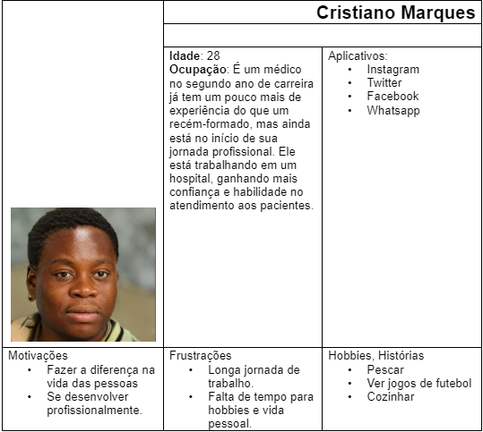

# Informações do Projeto
`PET GETS`  

Trabalho Interdisciplinar 

`CIÊNCIA DA COMPUTAÇÃO` 

## Participantes

Os membros do grupo são:
- João Pedro de Meireles Alves
- Paulo Henrique Braga Pessoa
- Rafael Lage Schichman
- Rafael Lucca Marques
- Rafael Correa Fernandes
- Arthur Campos Pereira

# Estrutura do Documento

- [Informações do Projeto](#informações-do-projeto)
  - [Participantes](#participantes)
- [Estrutura do Documento](#estrutura-do-documento)
- [Introdução](#introdução)
  - [Problema](#problema)
  - [Objetivos](#objetivos)
  - [Justificativa](#justificativa)
  - [Público-Alvo](#público-alvo)
- [Especificações do Projeto](#especificações-do-projeto)
  - [Personas, Empatia e Proposta de Valor](#personas-empatia-e-proposta-de-valor)
  - [Histórias de Usuários](#histórias-de-usuários)
  - [Requisitos](#requisitos)
    - [Requisitos Funcionais](#requisitos-funcionais)
    - [Requisitos não Funcionais](#requisitos-não-funcionais)
  - [Restrições](#restrições)
- [Projeto de Interface](#projeto-de-interface)
  - [User Flow](#user-flow)
  - [Wireframes](#wireframes)
- [Metodologia](#metodologia)
  - [Divisão de Papéis](#divisão-de-papéis)
  - [Ferramentas](#ferramentas)
  - [Controle de Versão](#controle-de-versão)
- [**############## SPRINT 1 ACABA AQUI #############**](#-sprint-1-acaba-aqui-)
- [Projeto da Solução](#projeto-da-solução)
  - [Tecnologias Utilizadas](#tecnologias-utilizadas)
  - [Arquitetura da solução](#arquitetura-da-solução)
- [Avaliação da Aplicação](#avaliação-da-aplicação)
  - [Plano de Testes](#plano-de-testes)
  - [Ferramentas de Testes (Opcional)](#ferramentas-de-testes-opcional)
  - [Registros de Testes](#registros-de-testes)
- [Referências](#referências)

# Introdução

Ao longo das últimas décadas, índices mundiais de problemas como a solidão e depressão vem sofrendo um aumento considerável. Assim, há uma clara antítese entre o paradigma atual de integração social através da tecnologia, e o real sentimento de acolhimento daqueles que desfrutam dessas tecnologias.
Nesse contexto, é possível apontar a adoção de animais de estimação como uma solução para aqueles que sofrem com as mazelas previamente apresentadas. E, por essa razão, é pertinente que se desenvolvam métodos para facilitar e simplificar esse processo de adoção, de modo a torná-lo mais acessível e atrativo àqueles que poderiam se beneficiar dele.
Além disso, não se pode esquecer da imensa importância da adoção para animais de rua e em situação de abandono, que agora passariam a desfrutar de moradia, alimentação, cuidado veterinário e afeto, além de livrá-los dos diversos perigos e prejuízos que encontram nas ruas.
Por outro lado, há ainda a necessidade de garantir que o animal adotado receba um tratamento de qualidade e, para isso, o novo dono deve ser devidamente instruído sobre como cuidar desse animal específico.

## Problema

A partir da realidade explicitada anteriormente, os problemas principais a serem mitigados por este projeto são o excesso de burocracia existente no processo de adoção de animais de estimação e a desinformação de novos adotivos com relação aos cuidados de seu animal.

## Objetivos

O objetivo geral deste projeto é a criação de uma plataforma que facilite o processo de adoção de animais de estimação e instrua seus usuários sobre os cuidados básicos de diversos animais expostos à adoção.
  Como objetivos específicos:
- Fornecer, ao usuário, o contato de casas de adoção próximas e com quais animais elas trabalham.
- Proporcionar, ao usuário, uma "ficha técnica" para diversos animais, que apresente suas necessidades básicas como alimentação, habitat e cuidados especiais.

## Justificativa

Segundo uma pesquisa do Instituto Ipsos, o Brasil é a nação em que as pessoas mais sofrem da solidão. 23 mil pessoas de 28 países foram entrevistadas em 2021, e cerca de 50% dos brasileiros responderam que se sentem sozinhos, enquanto a média global é de 33%.
 Além disso, de acordo com o InstitutoPetBrasil, existem hoje, no Brasil, cerca de 185.000 animais abandonados ou resgatados por maus-tratos sob a tutela de ONGs e grupos protetores.

## Público-Alvo

O público ao qual este projeto está direcionado são pessoas de todas as idades que estejam abertas à ideia de adotar um animal. Seja para lidar com problemas psicológicos, como a depressão, ou apenas para desfrutar da vida com um companheiro.

## Especificações do Projeto

A definição exata do problema e os pontos mais relevantes a serem tratados neste projeto foi consolidada com a participação dos usuários em um trabalho de imersão feita pelos membros da equipe a partir da observação dos usuários em seu local natural e por meio de entrevistas. Os detalhes levantados nesse processo foram consolidados na forma de personas e histórias de usuários.

## Personas, Empatia e Proposta de Valor

As personas levantadas durante o processo de entendimento do problema são apresentadas na Figuras que se seguem.

**Exemplo de Persona**

## Histórias de Usuários

A partir da compreensão do dia a dia das personas identificadas para o projeto, foram registradas as seguintes histórias de usuários:

|     EU COMO...     |          QUERO/PRECISO ...         |              PARA ...                                               |
|--------------------|------------------------------------|----------------------------------------                             |
|Maria Luísa         | Eu gostaria de adotar um gato.     | Na minha opinião, os gatos são criaturas adoráveis e afetuosas. Mesmo que cuidar de um gatinho seja uma grande responsabilidade, ainda sim gostaria de adotar, seria muito gratificante e divertido.|      
|Hélio Dias          | Eu estou interessado em adotar um cãozinho de porte pequeno e com um temperamento tranquilo.| Para mim ter um cão seria uma excelente forma de ter companhia em casa. Os cães são animais muito sociais e gostam de interagir com seus donos.|       
|Cristiano Marques   | Eu sou muito fã de cães, acho que teria um mais um em casa.| Sempre tive grande apreço por cachorros e os considero excelentes companheiros. A adoção de animais, em vez de comprá-los, é fundamental para ajudar a reduzir o número de bichinhos abandonados nas ruas.|                                                            
                                         
## Requisitos

O escopo funcional do projeto é definido por meio dos requisitos funcionais que descrevem as possibilidades interação dos usuários, bem como os requisitos não funcionais que descrevem os aspectos que o sistema deverá apresentar de maneira geral. Estes requisitos são apresentados a seguir.

### Requisitos Funcionais

|ID     | Descrição do Requisito  |Prioridade |
|-------|-----------------------------------------|----|
|RF-001 | O site deve apresentar uma página principal para o usuário encontrar o animal que deseja. |ALTA| 
|RF-002 | O site deve apresentar, para cada animal, uma imagem.   | ALTA |
|RF-003 | O site deve permitir ao usuário visualizar uma descrição completa do animal e do contato do doador. |ALTA|
|RF-004 | O site deve oferecer uma funcionalidade de filtro/pesquisa para permitir ao usuário localizar um animal específico. |ALTA|
|RF-005 | O site deve permitir visualizar as informações de contatos do mantenedor do site. |BAIXA|
|RF-006 | O site deve possuir um formulário que permita ao usuário enviar informações sobre um animal que ele deseja colocar para adoção. |MÉDIA|

### Requisitos não Funcionais

|ID     | Descrição do Requisito  |Prioridade |
|-------|-------------------------|----|
|RNF-001| O site deve ser publicado em um ambiente acessível publicamente na Internet (Repl.it, GitHub Pages, Heroku); |ALTA| 
|RNF-002| O site deverá ser responsivo permitindo a visualização em um celular de forma adequada |ALTA| 
|RNF-003| O site deve ser compatível com os principais navegadores do mercado (Google Chrome, Firefox, Microsoft Edge) |ALTA|
|RNF-004| O site deve ter bom nível de contraste entre os elementos da tela em conformidade |MÉDIA|

## Restrições

As questões que limitam a execução desse projeto e que se configuram como obrigações claras para o desenvolvimento do projeto em questão são apresentadas na tabela a seguir.

|ID| Restrição                                             |
|--|-------------------------------------------------------|
|RE-01| O projeto deverá ser entregue no final do semestre letivo, não podendo extrapolar a data estipulada.|
|RE-02| O aplicativo deve se restringir às tecnologias básicas da Web no Frontend.|
|RE-03| A equipe não pode subcontratar o desenvolvimento do trabalho.|

# Projeto de Interface

O projeto de interface foi pensado em conjunto visando algo otimizado e totalmente intuitivo que prioriza o nosso público alvo, que são as pessoas de toda a faixa etária. Dessa forma conseguiremos agradar todo o tipo de público que será usuária do site. Além disso, foi priorizado também de acordo com o que discutimos sobre os requisitos funcionais e não funcionais, para nao fugiir do que foi proposto.

## Wireframes

Wireframe pode ser definido como um modelo simplificado de uma estrutura de uma possível interface para o seu usuário. Utilizamos o wireframe para planejar e projetar as funcionalidades que estarão no site. Também foi possível utilizar as pessoas do mapa de stakeholders para obter um feedback antes de lançar o projeto.

**PROTÓTIPO DO WIREFRAME**

- Cabeçalho: Estará disposto uma logo oficial da marca e um menu interativo para o usuário se localizar.
- Conteúdo: Aqui ficara o conteúdo principal do site, onde buscaremos manter a atenção do usuário.
- Barra Lateral: Elemente de navegação lateral para o usuário filtrar o que for melhor para sua procurar no site.

**CONTEÚDO**

Com base na estrutura padrão, a página inicial do conteúdo irá destacar para o usuário uma lista de animais e suas especificações subjetivas, além de uma opção para vizualizar mais sobre.

**CABEÇALHO**

A aba de cabeçalho como já foi explicado anteriormente, estará disposta de uma logo marca oficial do nosso produto. Além de um menu interativo para que os usuários consigam se localizar facilmente.

**BARRA LATERAL**

A barra lateral será utilizada para a filtragem do conteúdo que o usuário quiser visualizar de acordo com sua preferência, nela está disponível: 
- Uma filtragem de espécies
- Uma filtragem para a raça
- Uma filtragem para a idade

**Versão Final do Wireframe**

Após a apresentação de todas as ideias e a reunião de todos os dados, o wireframe final foi definido baseado em todas as informações obtidas pelo grupo, e assim ele foi definido: 

# Metodologia

A metodologia abrange as definições de cada ferramenta utilizada tanto para desenvolvimento e correção dos códigos e outros artefatos quanto para a organização da equipe nas demais tarefas durante o trabalho.

A metodologia utilizada seguiu a seguinte ordem: 
- Brainstorming
- Planejamento
- Desing
- Desenvolvimento

**BRAINSTORMING**

O primeiro passo do grupo foi focado em uma reunião para apresentar todos os tipos de ideias e anotá-las no papel. Foi daqui que surgiu tudo que vai estar no projeto final.

**PLANEJAMENTO**

Nessa etapa, foi definido qual seria o objetivo do site, o mapa de stakeholders, o público-alvo, as personas e até os requisitos que serão implementados. Também foi definido algumas partes da estruturação do site.

**DESIGN**

Nessa etapa foi criado o layout do site, definimos elementos visuais, fontes, cores e até mesmo a criação de uma logo marca original.O design foi todo pensado em agradar todos os tipos de público que poderão acessar o site.

**DESENVOLVIMENTO**

No desenvolvimento foi definido qual seria a função de cada membro para a entrega da primeira parte do projeto. O processo de design thinking foi feito, a metodologia scrum auxiliou para que os prazos fossem entregues no momento ideal. Além de montada a apresentação do trabalho.

## Divisão de Papéis

A nossa equipe utiliza de uma metodologia mais rápida, tendo escolhido o Scrum como base para definição do processo de desenvolvimento.

A equipe está organizada da seguinte maneira: 
  - Scrum Master: Paulo Henrique Braga Pessoa
  - Product Owner: Rafael Lage Schichman
  - Equipe de Desenvolvimento:
    - Rafael Lucca Marques Vasconcelos
    - Rafael Correa 
    - Arthur Campos Pereira
    - João Pedro de Meireles Alves

## Ferramentas

| Ambiente  | Plataforma              |Link de Acesso |
|-----------|-------------------------|---------------|
|Processo de Design Thinkgin  | Miro | https://miro.com/app/board/uXjVMYDTJck=/ | 
|Repositório de código | GitHub | https://github.com/ICEI-PUC-Minas-PPLCC-TI/ti-1-ppl-cc-m-20231-pets | 
|Protótipo Interativo | MavelApp ou Figma | https://www.figma.com/file/vOfHaCpzDplgBNtKMsL5Dy/Untitled?node-id=0%3A1&t=wTTWRs2SQfOkUVX7-1 | 

# **############## SPRINT 1 ACABA AQUI #############**

# Projeto da Solução

## Tecnologias Utilizadas

|            TIPO               |         NOME        |
|-------------------------------|---------------------|
| Linguagem de marcação         |         HTML        |
| Linguagem de programação      |      JavaScript     |
| Estilização                   |         CSS         | 
| Biblioteca para armazenamento |        jQuery       |
| IDE                           |       VS Code       |
| Organização dos códigos       |         Git         |
| Controle de Versão            |        GitHub       |
| Hospedagem                    |         Repl        |

## Arquitetura da solução

> 
> 
>
Ao entrar no site o usuário irá visualizar de cara a home page, isso foi pensado para facilitar o uso para os diveros públicos alvos do nosso projeto. O usuário terá a sua disposição diversas abas para navegar no site, um exemplo é aba de filtros, onde é feita a filtragem por Espécie, Sexo e Idade.
>
Além disso, o usuário encontrará em nosso site uma aba de formulário, onde ele pode colocar seu animalzinho para adoção. Também irá ter acesso a uma aba para visualizar as instituições de adoção que estão disponíveis para ser feito um contato. E não menos importante, existe uma de dúvidas, para que o usuário possa verificar perguntas frequentes.

# Avaliação da Aplicação

## Plano de Testes

| ID | POSSIBILIDADES | REQUISITOS |
|----|---------|-----------------------|
| 1 | Exibir uma lista de cards de animais disponíveis para adoção. | RF-01 |
| 1 | Exibir uma lista de cards de casas de adoção | RF-01 |
| 2 | Incluir uma barra de pesquisa para permitir que os usuários pesquisem animais por nome, espécie, raça, etc. | RF-02 |
| 2 | Permitir que as casas de adoção se cadastrem no site, fornecendo informações como nome, endereço, contato, etc. | RF-02 |
| 3 | Implementar filtros para permitir que os usuários refinem a pesquisa por critérios específicos, como espécie, idade, tamanho, etc.| RF-03 |
| 3 | Incluir uma barra de pesquisa para permitir que os usuários pesquisem casas de adoção por nome, localização, etc.| RF-03 |
| 4 | Incluir um botão "Ver mais" em cada card de animal que leva para um pagina de descrição.| RF-04 |
| 4 | Incluir um botão "Ver mais" em cada card de casa de adoção, que abre um pop-up com mais informações.| RF-04 |

## Registros de Testes

Os testes ajudaram a visualizar na prática as ideias que seriam possíveis de serem realizadas e também as ideias que precisariam ser modificadas. Foi um processo difícil mas ajudou bastante a entender como seria o processo de realização profissional da criação de um projeto.

# Referências

......  COLOQUE AQUI O SEU TEXTO ......

> Inclua todas as referências (livros, artigos, sites, etc) utilizados
> no desenvolvimento do trabalho.
> 
> **Links Úteis**:
> - [Formato ABNT](https://www.normastecnicas.com/abnt/trabalhos-academicos/referencias/)
> - [Referências Bibliográficas da ABNT](https://comunidade.rockcontent.com/referencia-bibliografica-abnt/)
